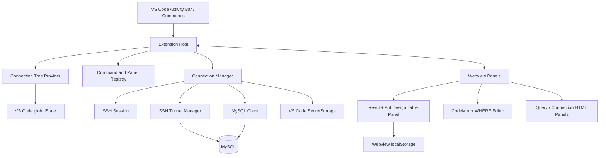

# Connect Toolbox

> A VS Code workbench for connections, terminals, SQL queries, and table editing.

[简体中文](README.md) · English

[GitHub Repository](https://github.com/Connect-Workbench/connect-toolbox) · [Issues](https://github.com/Connect-Workbench/connect-toolbox/issues)

## Overview

Connect Toolbox is a developer-oriented connection and data workbench for VS Code. It brings server connections, SSH terminals, MySQL queries, table browsing, and data editing into the same workspace.

The project is designed to reduce the need to switch between database clients, terminal tools, and editors during day-to-day development and operations.

The current version is `0.1.0` and the minimum supported VS Code version is `1.85.0`.

> Current status: the SSH and MySQL workflows are usable. Redis connection configuration and tree display are available, but the Redis client, key browser, and value editor are planned for a later milestone.

## Features

### Connection management

- Configure `SSH`, `MySQL`, and `Redis` connections.
- Create, edit, delete, and group connection profiles.
- Display connection status: disconnected, connecting, connected, or failed.
- Expand connected MySQL instances to browse databases, tables/views, and columns.
- Filter databases and tables, with tree filters and expanded state persisted across sessions.
- Remember recently opened query and table panels and attempt to restore them when the extension starts.
- Support Simplified Chinese and English UI, following the VS Code display language.

### SSH connections and remote terminal

- Password authentication.
- Private-key authentication with optional passphrase.
- `~` expansion for private-key paths; private-key files are not copied into the extension directory.
- Interactive remote terminals implemented with the VS Code Pseudoterminal API.
- SSH local port forwarding.
- MySQL over SSH tunneling: the extension creates a local forwarding port automatically and releases it when the connection is closed.

### MySQL query panel

- Connect directly to MySQL or through an SSH tunnel.
- Execute arbitrary SQL statements.
- Render `SELECT` results as a table; show affected rows and execution time for `INSERT`, `UPDATE`, `DELETE`, and DDL statements.
- Run the current statement with `Cmd/Ctrl + Enter`.
- Display `NULL`, Buffer values as hexadecimal, execution status, and database errors.
- Provide a focused SQL editor and result area inside VS Code.

### MySQL table workbench

- Browse table data with pagination, first/last page navigation, quick jumping, and refresh.
- Sort columns in ascending or descending order.
- Filter columns with these MySQL operators:

  ```text
  =  !=  <>  >  >=  <  <=
  LIKE  NOT LIKE
  IN  NOT IN
  BETWEEN  NOT BETWEEN
  REGEXP  NOT REGEXP
  IS NULL  IS NOT NULL
  ```

- Use the single-line `WHERE` condition editor above the table:
  - Powered by CodeMirror with SQL syntax highlighting.
  - Provides completion for columns in the current table and common SQL suggestions.
  - Supports bracket and quote editing behavior.
  - Accepts a single-table filter expression, not a complete `SELECT` or an independent SQL statement.
  - Combines with column-header filters using `AND`.
  - Press `Enter` to apply the condition; clear the text and press `Enter` to remove it.
- Double-click cells for inline editing.
- Copy, add, modify, mark for deletion, and undo local row/cell operations.
- Open cell content in a VS Code editor and synchronize it back to the table draft.
- Submit staged inserts, updates, and deletes through one commit action.
- Use a transaction for batch writes: commit only when all operations succeed; roll back on failure.
- Require primary-key information to locate rows for updates and deletes.
- Configure column visibility, select/clear all columns, restore the default order, resize columns, and pin columns.
- View a formatted `SHOW CREATE TABLE` statement as a read-only SQL document.

### Redis status

The Redis connection model, configuration form, and tree display are in place, but the Redis client workflow is not complete yet. The following capabilities are planned and should not be considered available in the current version:

- Redis connection and connection testing.
- Redis key browsing, searching, and type detection.
- Redis value viewing, editing, deletion, and TTL management.
- Redis connections through SSH tunnels.

## Usage

### Install a built VSIX

```bash
code --install-extension connect-toolbox-0.1.0.vsix
```

You can also use **Install from VSIX...** from the VS Code Extensions view.

### Typical workflow

1. Open the `Connect Toolbox` activity bar in VS Code.
2. Select **New Connection** and enter the connection type, host, port, and authentication details.
3. Connect the SSH or MySQL profile.
4. Open a remote terminal for SSH, or expand the database tree for MySQL.
5. Open the query panel, table data panel, or DDL view from a connection, database, or table node.

## Architecture



### Extension Host

`src/extension.ts` initializes connection storage, connection lifecycles, SSH tunnels, the TreeView, commands, and Webviews. The main modules are:

- `src/connection/`: connection profiles, persistence, and lifecycle management.
- `src/ssh/`: SSH sessions, remote terminals, and local port forwarding.
- `src/clients/`: MySQL client, metadata discovery, paginated queries, and transactional commits.
- `src/providers/`: TreeView, DDL documents, and cell editors.
- `src/commands/`: connection management, queries, table data, tree filtering, and panel restoration.
- `src/webviews/`: Extension Host bridge logic for query, connection, and table panels.

### Webview layer

- The table data panel uses React, Ant Design, and CodeMirror.
- The query and connection forms use lightweight HTML/CSS/JavaScript Webviews.
- Webviews communicate with the Extension Host through `postMessage`; they do not access MySQL or SSH directly.
- Table editing, filtering, sorting, and pagination state are primarily managed in the Webview, while database operations are delegated to the Extension Host and client layer.

### Data flow

```text
Webview action
    -> postMessage
    -> src/webviews/* message handler
    -> ConnectionManager
    -> MySqlClient / SshSession
    -> MySQL or remote SSH service
    -> result sent back to the Webview
```

## Storage and security

- Passwords and private-key passphrases are stored in VS Code `SecretStorage`.
- Connection names, hosts, ports, usernames, groups, and private-key paths are stored as non-secret data in VS Code `globalState`.
- Private-key files are referenced by path and are not copied into the extension directory or committed to the repository.
- Table column visibility, widths, and pinning preferences are stored in Webview `localStorage`.
- Structured table filters, pagination, and edit parameters use bound parameters. The single-line `WHERE` input is constrained to a single-table condition and rejects complete SQL, multiple statements, and comments.
- The query panel intentionally allows arbitrary SQL. Use extra care with `UPDATE`, `DELETE`, and DDL statements when using a database account with write permissions.

## Project structure

```text
connect-toolbox/
├── src/
│   ├── clients/        # MySQL and other database clients
│   ├── commands/       # VS Code commands and panel registration
│   ├── connection/     # Connection profiles, storage, and lifecycle
│   ├── providers/      # TreeView, DDL, and cell editor providers
│   ├── ssh/            # SSH sessions, terminals, and tunnels
│   ├── webviews/       # Extension Host Webview bridge
│   └── extension.ts    # Extension entry point
├── webview/
│   └── src/            # React/CodeMirror Webview frontend
├── resources/          # Extension icons and other resources
├── package.json        # Extension manifest and build scripts
├── esbuild.mjs         # Extension Host build configuration
└── README.md           # Simplified Chinese documentation
```

## Local development

### Requirements

- VS Code `1.85.0` or newer.
- Node.js and npm.
- Network access to the target MySQL and/or SSH services.

### Install dependencies

The root project and the Webview have separate dependency manifests. Install both on the first setup:

```bash
npm install
cd webview
npm install
cd ..
```

### Common scripts

| Command | Description |
| --- | --- |
| `npm run build` | Build the Webview and bundle the Extension Host to `dist/extension.js`. |
| `npm run build:webview` | Build Webview assets into `webview-dist/`. |
| `npm run watch` | Watch and rebuild the Extension Host. |
| `npm run dev:webview` | Start the Vite Webview development server, normally on port `5173`. |
| `npm run typecheck` | Type-check the Extension Host. |
| `npm run typecheck:webview` | Type-check the Webview. |
| `npm run package` | Run a full build and generate a `.vsix` package. |

### F5 debugging

Open the project root in VS Code and press `F5`. The repository provides two debug modes:

- **Run Extension (Hot Reload)**: starts the Extension Host watcher and the Webview Vite server together.
- **Run Extension (Production Assets)**: builds the Webview and extension first, then starts the debug host with production assets.

If the hot-reload Webview reports that resources from `localhost:5173` cannot be loaded, make sure `npm run dev:webview` is still running. If the Vite dependency cache is stale, rebuild it with:

```bash
cd webview
rm -rf node_modules/.vite
npm run dev -- --force
```

### Pre-commit checks

```bash
npm run typecheck
npm run typecheck:webview
npm run build
```

## Roadmap

The roadmap is tentative and may change as the workbench evolves.

### M3 — Redis workflow

- Complete the Redis client and connection test.
- Support Redis connections through SSH tunnels.
- Add key-space browsing, search, type detection, and TTL display.
- View, edit, and delete common Redis data types.

### M4 — Query and data workflow improvements

- Add query history, saved queries, and reusable SQL snippets.
- Improve SQL completion, formatting, diagnostics, and schema-aware suggestions.
- Evaluate multi-result-set rendering, query cancellation, and long-running query state.
- Add clearer confirmation and preview flows for high-risk SQL and data changes.

### M5 — Connection and collaboration capabilities

- Evaluate SSH Agent, Keyboard-Interactive, and other authentication methods.
- Improve connection health checks, reconnect strategies, and tunnel diagnostics.
- Evaluate secure connection-profile import/export and team-sharing workflows.
- Add broader automated test coverage, continuous integration, and release automation.

## License

The package metadata declares the project under the MIT License. A standalone `LICENSE` file will be added before a formal release if required.
