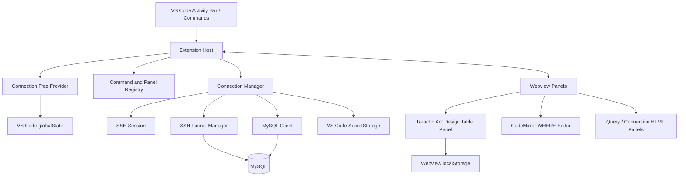

# Connect Toolbox

> 面向 VS Code 的连接、终端、SQL 查询与数据编辑工作台。

[English](README.en.md) · 简体中文

[GitHub Repository](https://github.com/Connect-Workbench/connect-toolbox) · [Issues](https://github.com/Connect-Workbench/connect-toolbox/issues)

## 项目简介

Connect Toolbox 是一个运行在 VS Code 中的开发者连接与数据工作台，目标是在同一个工作区内完成服务器连接、SSH 终端、MySQL 查询、表数据浏览和数据编辑。

它将连接树、终端、查询面板和表格编辑器组织在 VS Code 的原生工作流中，减少在多个数据库客户端、终端工具和编辑器之间切换的成本。

当前版本为 `0.1.0`，最低支持 VS Code `1.85.0`。

> 当前实现状态：SSH 和 MySQL 主流程可用；Redis 目前已支持连接配置和树节点展示，但 Redis 客户端连接、键浏览和键值编辑仍在后续路线图中。

## 功能特性

### 连接管理

- 支持配置 `SSH`、`MySQL` 和 `Redis` 连接。
- 支持连接配置的新建、编辑、删除和分组展示。
- 在连接树中显示连接状态：未连接、连接中、已连接或失败。
- MySQL 连接成功后，可展开数据库、表/视图和列信息。
- 支持过滤数据库和表，并持久化树节点筛选与展开状态。
- 最近打开的查询面板和表数据面板会被记录，插件启动时尝试恢复。
- 支持简体中文和英文 UI，并跟随 VS Code 的显示语言。

### SSH 连接与远程终端

- 支持密码认证。
- 支持私钥认证和私钥口令。
- 私钥路径支持 `~` 展开，私钥文件本身不会被复制到插件目录。
- 通过 VS Code Pseudoterminal 打开交互式 SSH 远程终端。
- 提供 SSH 本地端口转发能力。
- MySQL 已支持通过 SSH 隧道连接：插件会自动建立本地转发端口，并在断开时释放隧道。

### MySQL 查询

- 支持 MySQL 直连或通过 SSH 隧道连接。
- 支持执行任意 SQL 语句。
- `SELECT` 结果以表格展示；`INSERT`、`UPDATE`、`DELETE` 和 DDL 语句显示影响行数与执行耗时。
- 支持 `Cmd/Ctrl + Enter` 快捷执行。
- 支持显示 `NULL`、Buffer 十六进制值和数据库返回的错误信息。
- 查询面板提供 SQL 编辑区、执行状态和结果信息。

### MySQL 表数据工作台

- 按分页浏览表数据，支持首页、末页、快速跳页和刷新。
- 表头支持升序/降序排序。
- 列过滤支持以下 MySQL 操作符：

  ```text
  =  !=  <>  >  >=  <  <=
  LIKE  NOT LIKE
  IN  NOT IN
  BETWEEN  NOT BETWEEN
  REGEXP  NOT REGEXP
  IS NULL  IS NOT NULL
  ```

- 表格上方提供单行 `WHERE` 条件输入：
  - 基于 CodeMirror，支持 SQL 语法高亮。
  - 支持当前表字段补全和常用 SQL 提示。
  - 支持括号、引号等编辑体验。
  - 只接受单表过滤表达式，不执行完整 `SELECT` 或其他独立语句。
  - `WHERE` 条件与列头简单过滤条件始终按 `AND` 关系组合。
  - 按 `Enter` 应用过滤条件，清空内容后按 `Enter` 可移除该条件。
- 支持双击单元格进行内联编辑。
- 支持复制当前行、增加行、修改行、标记删除和撤销本地操作。
- 支持在 VS Code 编辑器中打开单元格内容进行编辑，并同步回表格暂存区。
- 本地暂存的新增、修改和删除可以通过一次“提交变更”统一写入数据库。
- 批量写入使用事务：全部成功才提交，任一操作失败则回滚。
- 修改和删除依赖主键定位；没有主键的表不能进行对应的数据编辑操作。
- 支持列显示/隐藏、全选/清空、恢复默认顺序、拖动调整列宽和固定列。
- 支持查看格式化后的 `SHOW CREATE TABLE` 建表语句，并以只读 SQL 文档打开。

### Redis 当前状态

Redis 连接模型、配置表单和连接树展示已经建立，但 Redis 客户端主流程尚未完成。以下能力属于后续计划，不应视为当前版本已支持：

- Redis 实际连接与连接测试。
- Redis 键浏览、搜索和类型识别。
- Redis 键值查看、编辑、删除和 TTL 管理。
- Redis 通过 SSH 隧道连接。

## 使用方式

### 安装已构建的 VSIX

```bash
code --install-extension connect-toolbox-0.1.0.vsix
```

也可以在 VS Code 的“扩展”视图中选择“从 VSIX 安装”。

### 基本工作流

1. 打开 VS Code 的 `Connect Toolbox` 活动栏。
2. 点击“新建连接”，填写连接类型、主机、端口和认证信息。
3. 对 SSH 或 MySQL 连接执行“连接”。
4. SSH 连接可打开远程终端；MySQL 连接可展开数据库树。
5. 在连接、数据库或表节点上打开查询面板、表数据面板或建表语句。

## 架构



### Extension Host

入口为 `src/extension.ts`，负责初始化连接存储、连接生命周期、SSH 隧道、TreeView、命令和 Webview。主要模块包括：

- `src/connection/`：连接配置、持久化和连接生命周期管理。
- `src/ssh/`：SSH 会话、远程终端和本地端口转发。
- `src/clients/`：MySQL 客户端、数据库元数据、分页查询和事务提交。
- `src/providers/`：连接树、DDL 文档和单元格编辑器等 VS Code Provider。
- `src/commands/`：连接管理、查询、表数据、树过滤和面板恢复命令。
- `src/webviews/`：查询面板、连接表单和表数据面板的主进程桥接逻辑。

### Webview 层

- 表数据面板使用 React、Ant Design 和 CodeMirror。
- 查询面板、连接表单使用轻量 HTML/CSS/JavaScript Webview。
- Webview 通过 `postMessage` 与 Extension Host 通信，不直接访问 MySQL 或 SSH。
- 表格编辑、过滤、排序和分页状态主要由 Webview 管理，实际数据库操作由 Extension Host 转发到客户端层执行。

### 数据与状态流

```text
Webview 操作
    -> postMessage
    -> src/webviews/* 消息处理
    -> ConnectionManager
    -> MySqlClient / SshSession
    -> MySQL 或远程 SSH 服务
    -> 结果通过 postMessage 返回 Webview
```

## 数据存储与安全

- 密码和私钥口令保存在 VS Code `SecretStorage` 中，使用系统提供的安全存储能力。
- 连接名称、主机、端口、用户名、分组和私钥路径等非敏感配置保存在 VS Code `globalState` 中。
- 私钥文件只保存路径，不会被复制到插件目录或提交到仓库。
- 表格列显示、列宽和固定列等界面偏好保存在 Webview `localStorage` 中。
- 表格的结构化过滤、分页和编辑参数使用参数绑定；单行 `WHERE` 输入会经过单表条件边界校验，拒绝完整 SQL、多语句和注释。
- 查询面板允许执行任意 SQL。使用具有写权限的数据库账号时，请谨慎执行 `UPDATE`、`DELETE`、DDL 等语句。

## 项目结构

```text
connect-toolbox/
├── src/
│   ├── clients/        # MySQL 等数据库客户端
│   ├── commands/       # VS Code 命令与面板注册
│   ├── connection/     # 连接配置、存储和生命周期
│   ├── providers/      # TreeView、DDL、单元格编辑器
│   ├── ssh/            # SSH 会话、终端和隧道
│   ├── webviews/       # Webview 主进程桥接
│   └── extension.ts    # 扩展入口
├── webview/
│   └── src/            # React/CodeMirror Webview 前端
├── resources/          # 扩展图标等资源
├── package.json        # 扩展清单与构建脚本
├── esbuild.mjs         # Extension Host 构建配置
└── README.en.md        # English documentation
```

## 本地开发

### 环境要求

- VS Code `1.85.0` 或更高版本。
- Node.js 和 npm。
- 能够访问目标 MySQL/SSH 服务的网络环境。

### 安装依赖

根项目和 Webview 使用独立的依赖清单，首次安装需要分别执行：

```bash
npm install
cd webview
npm install
cd ..
```

### 常用脚本

| 命令 | 说明 |
| --- | --- |
| `npm run build` | 构建 Webview，并将 Extension Host 打包到 `dist/extension.js`。 |
| `npm run build:webview` | 构建 Webview 资源到 `webview-dist/`。 |
| `npm run watch` | 监听并构建 Extension Host。 |
| `npm run dev:webview` | 启动 Webview Vite 开发服务器，默认端口 `5173`。 |
| `npm run typecheck` | 检查 Extension Host TypeScript 类型。 |
| `npm run typecheck:webview` | 检查 Webview TypeScript 类型。 |
| `npm run package` | 完整构建并生成 `.vsix` 安装包。 |

### F5 调试

在 VS Code 中打开项目根目录，按 `F5`，可选择：

- **运行扩展（热更新模式）**：并行启动 Extension Host watch 和 Webview Vite 开发服务。
- **运行扩展（生产产物模式）**：先构建 Webview 与扩展，再使用生产资源启动调试窗口。

如果热更新模式下出现 `localhost:5173` 资源加载失败，先确认 `npm run dev:webview` 仍在运行；依赖缓存异常时可使用：

```bash
cd webview
rm -rf node_modules/.vite
npm run dev -- --force
```

### 提交前检查

```bash
npm run typecheck
npm run typecheck:webview
npm run build
```

## Roadmap

以下路线图是当前规划，具体版本和时间可能调整。

### M3 — Redis 工作流

- 完成 Redis 客户端连接和连接测试。
- 支持 Redis 通过 SSH 隧道连接。
- 增加键空间浏览、搜索、类型识别和 TTL 展示。
- 支持常见 Redis 数据类型的查看、编辑和删除。

### M4 — 查询与数据工作流增强

- 增加查询历史、收藏查询和可复用 SQL 片段。
- 增强 SQL 补全、格式化、错误定位和字段/表结构提示。
- 评估多结果集展示、查询取消和长查询状态管理。
- 增加更明确的高风险 SQL 操作确认和数据变更预览。

### M5 — 连接与协作能力

- 评估 SSH Agent、Keyboard-Interactive 等更多认证方式。
- 完善连接健康检查、重连策略和隧道诊断信息。
- 评估连接配置的导入/导出与团队共享方案，并优先保证敏感信息安全。
- 增加更完整的自动化测试、持续集成和发布流程。

## 许可证

项目清单中声明使用 MIT License。正式发布前如需要独立许可证文件，将在仓库中补充 `LICENSE`。
